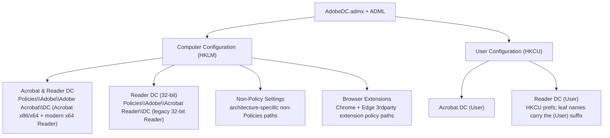

> I have spent many, many hours creating and testing this ADMX. If it helps you please consider buying me a Coffee :)

# Adobe DC ADMX/ADML Documentation

Detailed policy reference pages, changelogs, and curated guides live under [Documentation/](Documentation/).

> [!WARNING]
> **Migrating from v2.x or User ADMX v1.x is a breaking change.** The combined namespace and re-organised tree mean **Intune ADMX backups/exports from those versions will not import into v3.5**.
>
> Convert them first with [`Helper_Scripts/Convert-AdobeDcIntuneExportToCombinedV3.ps1`](Helper_Scripts/Convert-AdobeDcIntuneExportToCombinedV3.ps1), then re-import.
>
> See the [ADMX install guide](ADMX/readme.md) for migration steps. Upgrading from combined v3.0/v3.1/v3.2/v3.3/v3.4 to v3.5 keeps the same namespace and policy names for existing settings. **v3.4+ releases are additive-only** except where a changelog entry documents a one-time control-type correction - re-upload preserves existing Intune/GPO bindings for all other settings.

## Quick Links

|  |  |
|------|-------------|
| [Acrobat DC Settings (Device)](Documentation/acrobat-settings-device.md) | Machine-scope Acrobat DC policies |
| [Acrobat DC Settings (User)](Documentation/acrobat-settings-user.md) | User-scope Acrobat DC policies |
| [Reader DC Settings (Device)](Documentation/reader-settings-device.md) | Machine-scope Reader DC policies |
| [Reader DC Settings (User)](Documentation/reader-settings-user.md) | User-scope Reader DC policies |
| [Security Hardening (Device)](Documentation/security-hardening-device.md) | Recommended device security configurations |
| [Security Hardening (User)](Documentation/security-hardening-user.md) | Recommended user security configurations |
| [Reduce Nags & Upsells (Device)](Documentation/reduce-nags-device.md) | Device-scope nag and upsell controls |
| [Reduce Nags & Upsells (User)](Documentation/reduce-nags-user.md) | User-scope nag and upsell controls |
| [Built-in Attachment Permissions helper](Helper_Scripts/Set-AdobeBuiltInPermList.ps1) | REG_BINARY deployment for `tBuiltInPermList` (not in ADMX) |
| [Screenshots](Documentation/screenshots.md) | GPMC and Intune screenshots |
| [License](LICENSE.md) | CC BY-SA 4.0 license |

These ADMX/ADML templates (v3.5) provide Group Policy and Intune management of Adobe Acrobat DC and Adobe Reader DC on Windows. A single `AdobeDC.admx`/ADML pair covers machine-level (`HKLM`) and user-level (`HKCU`) policies.

|  |  |  |
|------|-------|----------|
| `AdobeDC.admx` + ADML | **Adobe DC** (Computer + User) | 834 (319 machine + 515 user) |

## Important Notes

|  |
|------|
| x64 Reader (Unified Installer) is configured under **Acrobat & Reader DC** (Acrobat hive), not the Reader hive. Configure legacy 32-bit Reader under **Reader DC (32-bit)**. |
| Some machine settings write outside `HKLM\SOFTWARE\Policies` and appear under **Adobe DC > Non-Policy Settings** with architecture-specific sub-nodes (**Acrobat & Reader DC (64-bit)**, **Acrobat DC (32-bit)**, **Reader DC (32-bit)**). See curated guides for marked entries. |
| Browser extension settings write to each browser's 3rdparty extension policy path under **Adobe DC > Browser Extensions** (Google Chrome / Microsoft Edge). Values are REG_SZ strings, not DWORD. See [Browser Extension Settings](Documentation/browser-extension.md). |
| Several ``bToggle*`` policies use inverted registry values (DWORD 0 = feature ON, DWORD 1 = feature OFF). |

## Category Overview (Device)

> Counts are product-scoped: settings that apply to both Reader and Acrobat are listed under each product, so Reader + Acrobat column totals are higher than the number of unique settings. The ADMX contains **319** machine policy entries (**155** unique machine settings after removing non-ADMX `tBuiltInPermList`; architecture-specific non-policy settings are emitted separately for x64 and x86). Overall template: **319** machine + **515** user = **834** policy entries.

|  |  |  |  |
|----------|----------|:------:|:-------:|
| Cloud & Connectors | Cloud storage connectors (Box, Dropbox, Google Drive, OneDrive), Document Cloud services, preferences sync, generative AI, and sign-in controls. | 13 | 16 |
| Context, Tools & Search | UI toolbars, context menus, search features, Modern Viewer, tool shortcuts, and editing mode settings. | 12 | 26 |
| Documents, Editing & Accessibility | PDF creation, editing, form handling, accessibility tagging, and document conversion controls. | 4 | 17 |
| Microsoft Purview (MIP) | Machine-level FeatureLockDown policies for Microsoft Purview Information Protection: MIP labelling lockdown, save-time policy checks, sovereign cloud selection, browser auth, double key encryption, and OS auth prompt control. | 6 | 6 |
| Security: Execution & Protection | Sandbox modes (Protected Mode, AppContainer, Protected View), enhanced security, Flash content, and dangerous action blocking. | 16 | 17 |
| Security: Trust & Permissions | Digital signatures, trusted locations, certificate trust, security handlers, and URL access policies. | 19 | 21 |
| Sharing & Features | Adobe Sign, Send & Track, shared reviews, SharePoint/Office 365 integration, WebMail configuration, and cloud signature storage. | 18 | 20 |
| Startup & Experience | Launch messages, notifications, First Time Experience, What's New, Home screen widgets, and feedback prompts. | 15 | 16 |
| Updates & Desktop Integration | Product updater, Chrome extension, Explorer thumbnails, repair options, desktop UI, and deployment settings. | 16 | 26 |
| Upsell | Upgrade prompts, trial purchase dialogs, promotional campaigns, App Center, and purchasable tool visibility. | 6 | 7 |
| **Total** | | **125** | **172** |

## Category Overview (User)

> Counts are product-scoped: settings that apply to both Reader and Acrobat are listed under each product. The ADMX contains **515** user policy entries.

|  |  |  |  |
|----------|----------|:------:|:-------:|
| Context, Tools & Search | Cursor and selection tools, hand-tool behavior, filename-as-title, recent files, Modern Viewer/HUD, search, and workflow UI preferences under HKCU. | 21 | 24 |
| Documents, Editing & Accessibility | Page display, zoom and layout defaults, rendering and fonts, commenting, forms, measurement, accessibility color replacement, and editing-related user preferences. | 80 | 83 |
| Microsoft Purview (MIP) | Per-user Microsoft Purview Information Protection (MIP) preferences under HKCU MicrosoftAIP, including document message bar visibility, policy authentication, and debug logging. | 3 | 3 |
| Security: Execution & Protection | User-level execution controls such as 3D/multimedia trust, JavaScript debugger and menu behavior, FIPS mode, and related HKCU security execution settings. | 9 | 16 |
| Security: Trust & Permissions | Digital signatures, certificate and timestamp validation, OCSP/CRL behavior, trust-manager URL permissions, and other HKCU signing and trust preferences. | 87 | 88 |
| Sharing & Features | Collaboration, Send & Track, shared reviews, cloud sharing hooks, and related feature toggles stored as per-user preferences. | 8 | 10 |
| Startup & Experience | Splash screen, launch alerts, onboarding and What's New dialogs, home-screen widgets, notifications, and first-run experience controls. | 28 | 28 |
| Updates & Desktop Integration | Product updater behavior, browser and Fast Web View integration, background download, thumbnails/shell integration, and desktop UI preferences. | 11 | 11 |
| Upsell | Upgrade prompts, trial purchase dialogs, promotional surfaces, App Center visibility, and purchasable-tool upsell controls. | 2 | 3 |
| **Total** | | **249** | **266** |

**Sharing & responsibility** - Built for the community, shared with good intentions. Use at your own risk. The author accepts no responsibility for any outcomes resulting from the use of these files. Always verify registry paths and values, and test in a safe environment first. If you find an issue or have a suggestion, contributions are welcome.